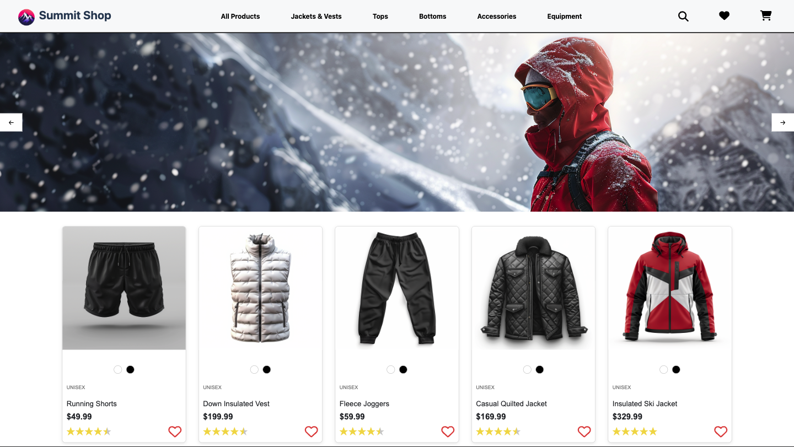

# Summit Shop - React E-commerce Store

## Project Overview
An e-commerce store for alpine clothing and equipment with dynamic functionality. Built with React, Google Firestore, React Router, SCSS, and Midjourney AI.

## Deployment Link
This e-shop is live! Check it out [here](https://react-ecommerce-store-project.netlify.app/).

## Screenshot

## Table of Contents
- [Goals & MVP](#goals--MVP)
- [Tech Stack](#tech-stack)
- [Build Steps](#build-steps)
- [Design Goals](#design-goals)
- [Project Features](#project-features)
- [Additions & Improvements](#additions--improvements)
- [Learning Highlights](#learning-highlights)
- [Known Issues](#known-issues)
- [Challenges](#challenges)

## Goals & MVP
The primary goal is to build a reactive e-shop website to demonstrate the ability to fetch and manage data using Firebase, navigate between different components with React Router, and implement dynamic user interactions.

## Tech Stack
- HTML
- CSS/SCSS
- JavaScript
- React
- React Router DOM
- Google Firestore
- Midjourney AI

## How to use
To start exploring the e-shop, visit the homepage where you can browse products, view details, and add items to your cart. Use the navigation links to switch between different views and manage your cart.

## Design Goals
- Emphasized the use of functional components in React and hooks for state management. 
- Decision to use Firestore was driven by the need for real-time data updates and easy scalability.

## Project Features
- [x] A dynamic carousel that swaps images on a timer
- [x] Firestore seeder scripts for database population
- [x] Product images generated exclusively by Midjourney AI
- [x] Search functionality built into the NavBar
- [x] Separate Cart database collection to separate concerns and improve scalability
- [x] Ability to favorite products and add them to cart

## Additions & Improvements
- [ ] Crop background on products page
- [ ] Change the landing page to be the products page while maintaining the current homepage
- [ ] Addition of mobile responsive design
- [ ] Integration of Stripe for test mode transactions.

## Learning Highlights
- Building more dynamic components in React
- Integration of a Firestore database
- Creating JavaScript database seeding scripts
- Dynamic filtering and searching of data on page 
- JavaScript -> Firestore database seeding scripts

## Challenges
- Building carousel 
- Fetching product data

## Contact Me
- Visit my [LinkedIn](https://www.linkedin.com/in/obj809/) for more details.
- Check out my [GitHub](https://github.com/cyberforge1) for more projects.
- Or send me an email at obj809@gmail.com
 
Thanks for your interest in this project. Feel free to reach out with any thoughts or questions.
 
 
Oliver Jenkins © 2024

