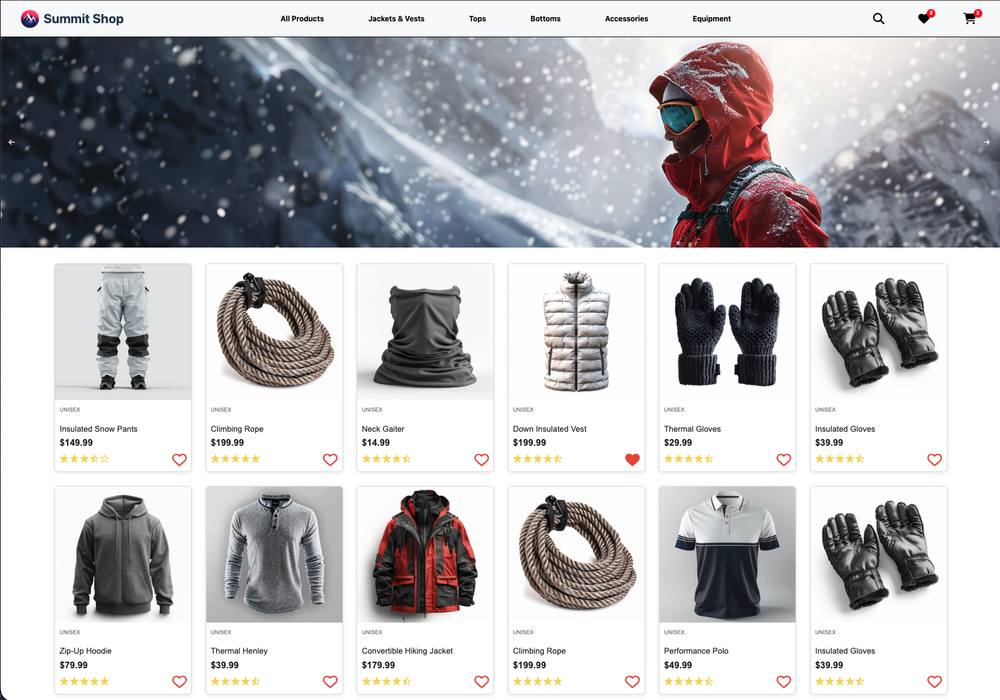

# Summit Shop - React E-commerce Store


## Project Overview
An e-commerce store for alpine clothing and equipment with dynamic functionality. Built with React, Google Firestore, React Router, and SCSS, with Stripe checkout (test mode) handled by Netlify serverless functions. Product imagery is generated with Midjourney AI.

## Deployment Link
This e-shop is live! Check it out [here](https://react-ecommerce-store-project.netlify.app/).

## Screenshot



## Table of Contents
- [Goals & MVP](#goals--MVP)
- [Tech Stack](#tech-stack)
- [Build Steps](#build-steps)
- [Design Goals](#design-goals)
- [Project Features](#project-features)
- [Additions & Improvements](#additions--improvements)
- [Learning Highlights](#learning-highlights)
- [Known Issues](#known-issues)
- [Challenges](#challenges)


## Goals & MVP
The primary goal is to build a reactive e-shop website to demonstrate the ability to fetch and manage data using Firebase, navigate between different components with React Router, and implement dynamic user interactions.


## Tech Stack
- HTML
- CSS/SCSS
- JavaScript
- React
- React Router DOM
- Google Firestore
- Stripe (test mode)
- Netlify Functions (serverless)
- Firebase Admin SDK
- Bootstrap 5
- FontAwesome
- Midjourney AI

## Build Steps
```bash
npm install            # install dependencies
npm run dev            # Vite dev server (front-end only)
netlify dev            # Vite + Netlify Functions together (required for checkout)
npm run build          # production build to dist/
```
Environment variables are read from a gitignored `.env` (see `.env.example` for the full list): the `VITE_FIREBASE_*` keys for the Firebase Web SDK, plus `STRIPE_SECRET_KEY` (a test key), `STRIPE_WEBHOOK_SECRET`, and `FIREBASE_SERVICE_ACCOUNT` for the Stripe functions.

## How to use
To start exploring the e-shop, visit the homepage where you can browse products, view details, and add items to your cart. Use the navigation links to switch between different views and manage your cart. At checkout, pay with the Stripe test card `4242 4242 4242 4242` (any future expiry and CVC) — no real payment is taken.


## Design Goals
- Emphasized the use of functional components in React and hooks for state management. 
- Decision to use Firestore was driven by the need for real-time data updates and easy scalability.

## Project Features
- [x] A dynamic carousel that swaps images on a timer
- [x] Firestore seeder scripts for database population
- [x] Product images generated exclusively by Midjourney AI
- [x] Search functionality built into the NavBar
- [x] Separate Cart database collection to separate concerns and improve scalability
- [x] Ability to favorite products and add them to cart
- [x] Stripe hosted checkout in test mode, powered by Netlify serverless functions
- [x] Interactive star ratings that persist a running average per product
- [x] Live cart and favorites count badges in the navigation bar
- [x] Stock-aware cart quantities that stay in sync with product inventory

## Additions & Improvements
- [x] Change the landing page to be the products page while maintaining the current homepage
- [x] Integration of Stripe for test mode transactions
- [ ] Crop background on products page
- [ ] Addition of mobile responsive design
- [ ] Release reserved stock from abandoned carts


## Learning Highlights
- Building more dynamic components in React
- Integration of a Firestore database
- Creating JavaScript database seeding scripts
- Dynamic filtering and searching of data on page 
- JavaScript -> Firestore database seeding scripts
- Integrating Stripe hosted checkout with Netlify serverless functions
- Verifying Stripe webhooks and keeping inventory in sync server-side


## Known Issues
- Cancelled or abandoned carts leave stock decremented (reserved) until the items are manually removed.
- The site is not yet optimised for mobile screens.
- The size selected on the product page is not yet carried through to the cart.


## Challenges
- Building carousel 
- Fetching product data
- Wiring Stripe checkout to a serverless backend without a traditional server


## Contact Me
- Visit my [LinkedIn](https://www.linkedin.com/in/obj809/) for more details.
- Check out my [GitHub](https://github.com/cyberforge1) for more projects.
- Or send me an email at obj809@gmail.com
<br />
Thanks for your interest in this project. Feel free to reach out with any thoughts or questions.
<br />
<br />
Oliver Jenkins © 2024

